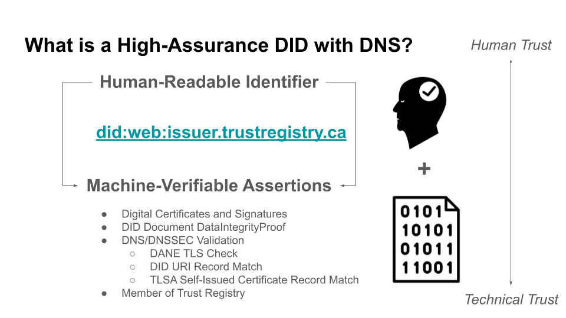
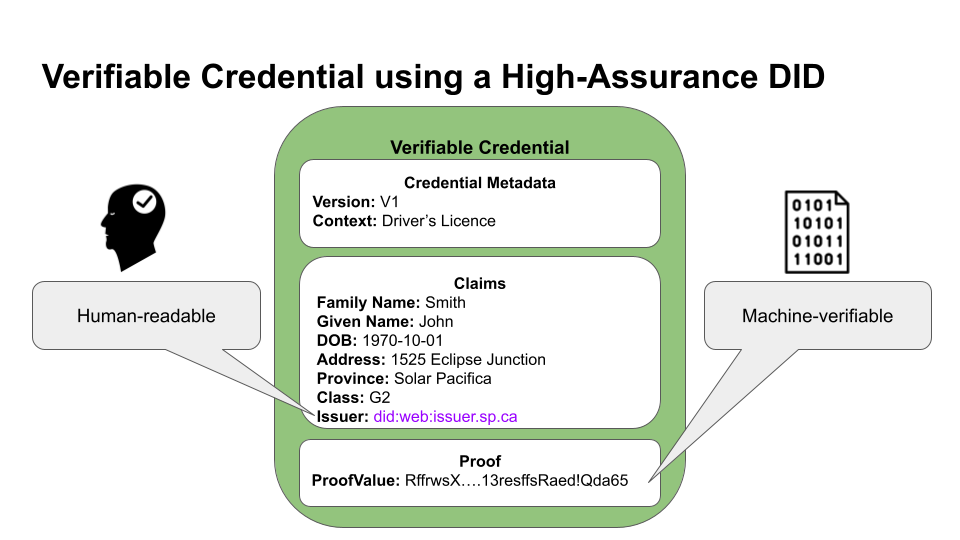

# DEC-02 Signer et vérifier avec mon domaine 
[Anglais](./dec-02.md)

## Vue d'ensemble 

Une utilisation intéressante des nouveaux identifiants décentralisés WC3 (DIDS W3C) est d'activer la capacité de « signer et vérifier avec mon domaine ». En termes simples, votre domaine, votre site Web - quelque chose qui est déjà bien connu de vos utilisateurs - devient un identifiant de confiance que vous pouvez utiliser pour signer tout ce que vous souhaitez vérifier. 

« Signer et vérifier avec mon domaine » offre un avantage immédiat aux propriétaires de sites Web qui peuvent tirer parti de leurs bureaux d'enregistrement de noms de domaine existants et de leurs autorités certifiées (CA) pour permettre la mise en œuvre d'identifiants de confiance. Cette approche est ouverte et non exclusive ; il fonctionne peu importe que le signataire autorisé soit un organisme gouvernemental, une entreprise commerciale ou un particulier. Pour résumer, cela fonctionne pour tout le monde parce que l'approche embrasse le web ouvert. 

Un facteur clé est l'identificateur décentralisé ou DID. Un DID est un nouveau composant normalisé par le World Wide Web Consortium (W3C). Un DID est un type d'URI unique au monde, hautement disponible et cryptographiquement vérifiable sans autorité centrale requise. Les DID peuvent être associés à une entité (DID Subject) au moyen de métadonnées décrivant l'entité (contenue dans le document DID) et comment interagir avec elle. Ce défi s'appuie sur une méthode spécifique: did:web qui permet une association avec un nom de domaine et son propriétaire. 

## Résultats attendus 

Une implémentation de travail conforme au DIDS de haute assurance avec DNS. En termes simples, un domaine de site Web ayant l'adresse de https://example.com devrait être en mesure de signer des documents avec les did:web:example.com DID correspondants. 

La possibilité de vérifier un document (pdf) ou des informations d'identification vérifiables à l'aide du DID de haute certification, par exemple did:web:example.com 

## Participation 

Nous recherchons des participants qui sont prêts à faire partie d'une cohorte pour démontrer. Les participants peuvent être des émetteurs, des vérificateurs ou, surtout, des détenteurs qui exigent que l'authenticité des documents soit confirmée. 

Quelques diagrammes utiles ci-dessous. La séance d'information complète peut être trouvée ici 

 

## DIAGRAMMES 

 Voici quelques diagrammes utiles ci-dessous. Le briefing complet se trouve [ici](./pubs/HIADID-Briefing.pdf)
 
 
 

Références clés 

DIDS de haute assurance avec RFC de brouillon DN IETF 