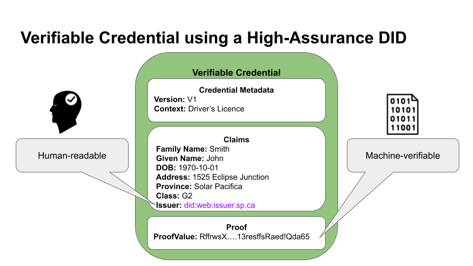

# DEC-02 Sign and Verify With My Domain
## Overview

A compelling use of the new WC3 Decentralized Identifiers (W3C DIDs) is enable the capability to “sign with my domain”. Simply put, your domain, your website, well-known to your users, becomes a trusted identifier you can use to sign anything.

“Sign with my domain” provides an immediate benefit to website owners using domain name registrars and CAs to enable the implementation of trusted identifiers. It works regardless of whether they are a government organization or an individual - it works for everyone because this approach embraces the open web.

A Decentralized Identifier (DID) is a global standard from the World Wide Web Consortium (W3C). A DID is a type of URI that is globally unique, highly available, and cryptographically verifiable with no required central authority. DIDs can be associated with an entity (DID Subject) by means of metadata describing the entity (contained within DID Document) and how to interact with it.

## Expected Outcomes

1. A working implementation in accordance with the High Assurance DIDS with DNS. In simple terms, a website dmain having the address of `http://example.com` should be able to sign documents with the correspond DID `did:web:example.com`.
2. The ability to verify a document (pdf) or verifiable credential using the High Assurance DID, for example `did:web:example.com`

## Participation

We are looking for participants who are willing be a part of a cohort to demonstrate. Participants can be issuers, verifiers, or most importantly, holders who require the authenticity of documents to be confirmed.

## Helpful Diagrams

A couple of helpful diagrams below. The full briefing can be found [here](./pubs/HIADID-Briefing.pdf)

## Key References

* High Assurance DIDS with DNS [IETF Draft RFC](https://www.ietf.org/archive/id/draft-carter-high-assurance-dids-with-dns-05.html)
